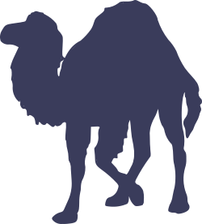

# Perl's Camel Usage

## Introduction

The Perl Language never had a definitive and official logo/mascot to represent it across different published material,
until Tim O'Reilly published in 1991 the first book about Perl, Programming Perl, which was presented with a *camel*
on its cover, which became widely known and used, unofficially, as the Perl's mascot since then. However, due to
O'Reilly, not so clear, restrictive rules on using the camel, different attempts of creating new logos was made during
the years, being that two are most prominent:

1. The onion, held by [The Perl Foundation](https://www.perlfoundation.org/trademarks.html);
2. The velociraptor, created by [Sebastian Riedel](https://github.com/kraih/perl-raptor).

Nevertheless, neither ideas experimented the same strength as the camel from [Programming
Perl](https://www.oreilly.com/library/view/programming-perl-4th/9781449321451/) book (the "Camel book"); the camel
still is, by far, the most used and known mascot on Perl ecosystem. With that, this guideline is about the current
state of camel's usage permission and restriction, following Tim O'Reilly advice and words after different emails
exchanged with him to better understand them.

Another caveat to note is the complexity of the original camel image, which was used in a book cover with enough canva
to draw a really detailed camel, really different from what is seen in the current days with small mobile screens,
where small versions of the original camel would be needed and the details would get lost and, consequently, deforming
the original image, i.e. website favicons or menu/button icons. Hence a simplified version of the camel was adopted,
the [_shadowed camel_](https://icon-icons.com/icon/file-type-perl/130272), which follows the original camel silhouette
and substitutes its internal details completely by a single solid color.

## Shadowed Camel License

The _shadowed camel_ was drawn by [Roberto Huertas](https://robertohuertas.com/) and is licensed under Creative
Commons 4.0 license, [CC-BY-4.0](https://creativecommons.org/licenses/by/4.0/), which allow free usage and sharing if:

1. Appropriate credit is given;
2. A link to the license is provided;
3. Changes are indicated.

This camel is the same used by Visual Studio Code as file type icon for Perl file extensions (`.pl` and `.pm`).

## Logos

Programming Perl book cover | Shadowed Camel by Roberto Huertas
:--------------------------:|:--------------------------:
 | 

## Usage guideline

Following are the permissions and allowances that we, the Perl community, must follow when using the **original** and
the **shadowed** camels:

We, the Perl community, are **not allowed** to use the **original** camel image for:

1. Publishing new books or materials using the camel with a different publisher other than O'Reilly;
2. Self-publish new books or materials using the camel.

We, the Perl community, are **allowed** to use the **shadowed** camel image for:

1. Referencing the Perl Language (as its official mascot);
2. Sharing free and open source material in the internet;
3. Conferences, workshops, meetings, or any in person reunion to reference Perl on advertising materials.

Wherever and whenever possible, always link the shadowed camel to https://www.perl.org, clearing any doubts about the
Perl Language relation with the logo.

This guildeline is solely related to the **shadowed camel** and to clarifications on the original camel usage, other
camels or logos used to reference the Perl Language are not under any restrictions of this guideline.

From the date of writhing this guideline onwards, the **Perl community** accepts the **shadowed camel** as its official
mascot.

## Logo kit

Shadowed camel:



Combined logo:


Currently, the following variants are available:
- [SVG format](kit/shadowed-camel.svg)
- [SVG format with margins](kit/shadowed-camel-margins.svg)
- [SVG format for combined logo](kit/shadowed-camel-combined.svg)
- [PNG format (250 x 276)](kit/shadowed-camel-250x276.png)
- [PNG format (500 x 552)](kit/shadowed-camel-500x552.png)
- [PNG format (1100 x 1215)](kit/shadowed-camel-1100x1215.png)
- [PNG format for combined logo (250 x 109)](kit/shadowed-camel-combined-250x109.png)
- [PNG format for combined logo (600 x 238)](kit/shadowed-camel-combined-600x238.png)
- [PNG format for combined logo (1500 x 652)](kit/shadowed-camel-combined-1500x652.png)
- [PNG format with margins (250 x 276)](kit/shadowed-camel-margins-250x276.png)
- [PNG format with margins (600 x 650)](kit/shadowed-camel-margins-600x650.png)
- [PNG format with margins (1100 x 1205)](kit/shadowed-camel-margins-1100x1205.png)

Notes:
- The color used is `#3a3c5b`, there's a long tradition of using this "purple blue" (specifically this "indigo blue")
  for filling the shadowed camel

### Icons
- [PNG format (16 x 16)](kit/shadowed-camel-icon-16x16.png)
- [PNG format (22 x 22)](kit/shadowed-camel-icon-22x22.png)
- [PNG format (24 x 24)](kit/shadowed-camel-icon-24x24.png)
- [PNG format (32 x 32)](kit/shadowed-camel-icon-32x32.png)
- [PNG format (48 x 48)](kit/shadowed-camel-icon-48x48.png)
- [PNG format (64 x 64)](kit/shadowed-camel-icon-64x64.png)

### Favicons
We also provide a [zip folder containing favicons](kit/perl-favicons.zip). Unzip it at root of your website and insert
the following code in the `<head>` section of your pages: 
```html
<link rel="apple-touch-icon" sizes="180x180" href="/apple-touch-icon.png">
<link rel="icon" type="image/png" sizes="32x32" href="/favicon-32x32.png">
<link rel="icon" type="image/png" sizes="16x16" href="/favicon-16x16.png">
<link rel="manifest" href="/site.webmanifest">
<meta name="msapplication-TileColor" content="#da532c">
<meta name="theme-color" content="#ffffff">
```
